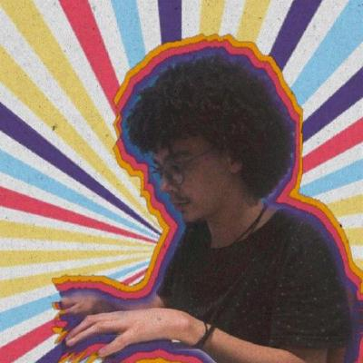
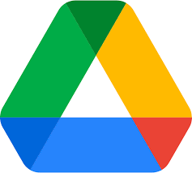

# Plant Jammer

> TODO: ESCREVER UM README SOBRE ESSE PROJETO

## Equipe
 Foto | Nome | Email | GitHub |
 ---- | ---- | ----- | ------ |
 | Durval Carvalho de Souza	 | dudurval2@gmail.com | [@durvalcarvalho](https://github.com/durvalcarvalho) |
 | Hugo Rocha de Moura	| hugo@eletricaecia.com.br | [@hugorochaffs](https://github.com/hugorochaffs) |
 | João Victor de Oliveira Matos	 | joao15victor08@gmail.com | [@joao15victor08](https://github.com/joao15victor08) |
 | Leonardo Gomes | leonardo@gomes.com | [@LeoSilvaGomes](https://github.com/LeoSilvaGomes) |
 | Victor Jorge | victor@jorge.com | [@VictorJorgeFGA](https://github.com/VictorJorgeFGA) |

## Ferramentas
 Icons|  |
 ---- | ---- |
 |  Docsify  | 
 |    Github    |
 | Visual Studio Code	 |
 | Google Drive	 |
 | Jitsi Meet	 |
 | Telegram	 |
